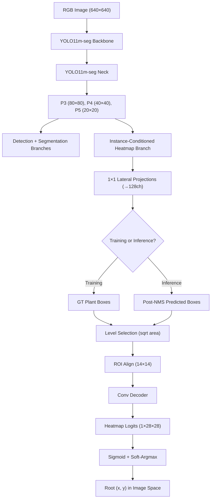

# YOLO-Seg-Root: Comparative Root Localization Framework for Smart Agriculture

A research framework based on **YOLO11m-seg** for plant instance detection, segmentation, and root-point localization in smart autonomous agriculture.

This repository implements and compares **6 root localization strategies** under strict experimental fairness:

1. **Direct Regression (`direct_regression`)** *(Thesis Baseline)*: Direct root coordinate prediction in feature-map stride space.
2. **Direct Image-Space Distribution Focal Loss (`direct_dfl`)**: Full-image normalized coordinate prediction via discrete binned distribution prediction and expectation decoding (box-independent).
3. **Box-Relative Offset Regression (`box_offset`)**: Scale-invariant sigmoid offset regression relative to bounding box boundaries.
4. **Box-Relative Distribution Focal Loss Regression (`box_dfl`)**: Discrete binned distribution prediction relative to bounding box boundaries with expected value decoding and entropy uncertainty estimation.
5. **ROI / Flattened Heatmap Localization (`heatmap`)** *(Exploratory)*: Per-anchor 2D spatial Gaussian heatmap prediction with soft-argmax integral decoding.
6. **Instance-Conditioned Heatmap (`instance_conditioned_heatmap`)**: True instance-level heatmap architecture using ROI Align on P3/P4/P5 features with a convolutional decoder to produce one local root heatmap per detected plant.

---

## 🌟 Key Features

- **Strict Experimental Fairness**: Shared YOLO11m-seg backbone, segmentation head, detection head, loss gains, dataset splits, resolution ($640 \times 640$), optimizer, and augmentation setup across all methods.
- **Weed-Focused Copy-Paste Augmentation**: Class-specific instance cropping & pasting with affine synchronization of polygon masks and root point coordinates.
- **Comprehensive Root Metrics**:
  - `PCK@2.5`, `PCK@5`, `PCK@10`, `PCK@20` (normalized by ground-truth bounding box diagonal $\sqrt{w^2 + h^2}$).
  - `AbsPCK@2.5px`, `AbsPCK@5px`, `AbsPCK@10px`, `AbsPCK@20px` (absolute pixel radii).
  - `mean_npe`, `median_npe`, `pixel_mae`, `pixel_rmse`.
  - Per-class `PCK@10` for all 4 plant categories.
- **Oracle-Box Evaluation**: Decodes box-dependent root predictions using ground-truth bounding boxes to isolate root localization error from bounding-box detection error ($\text{NPE}_{\text{normal}} - \text{NPE}_{\text{oracle}}$).
- **Full Ablation Support**:
  - DFL bin count ($B \in \{8, 16, 32\}$).
  - Heatmap resolution ($H \times W \in \{16 \times 16, 32 \times 32\}$).
  - Heatmap decoding (`softargmax` vs `argmax`).

---

## 📁 Project Structure

```
YOLO-Seg-Root-Comparative/
├── common/
│   ├── config.py                    # Config loader with automatic dataset path fallback
│   ├── dataset.py                   # Dataset loader & weed-focused copy-paste augmentation
│   ├── instance_heatmap_ops.py      # Instance-Conditioned Heatmap operations (ROI, targets, decoding)
│   ├── matching.py                  # Class-aware greedy IoU matching (IoU >= 0.50)
│   ├── metrics.py                   # Box & mask mAP calculation
│   ├── model_utils.py               # Dynamic model building & loss dispatcher
│   ├── root_ops.py                  # Core root decoding, encoding, and PCK/NPE math
│   └── visualization.py             # Render bounding boxes, masks, and root points
├── models/
│   ├── direct_regression.py         # CustomSegmentHead (baseline direct regression)
│   ├── direct_dfl.py                # CustomDirectDFLHead (full-image normalized DFL)
│   ├── box_offset.py                # CustomBoxOffsetHead (sigmoid box-relative offset)
│   ├── box_dfl.py                   # CustomBoxDFLHead (binned box-relative DFL + expectation)
│   ├── roi_heatmap.py               # CustomROIHeatmapHead (flattened per-anchor heatmap)
│   └── instance_conditioned_heatmap.py # Instance-Conditioned Heatmap head + decoder
├── losses/
│   ├── direct_loss.py               # Multi-task loss with direct pixel Smooth-L1 root loss
│   ├── direct_dfl_loss.py           # Multi-task loss with full-image normalized DFL & entropy
│   ├── box_offset_loss.py           # Multi-task loss with normalized relative Smooth-L1
│   ├── root_dfl_loss.py             # Multi-task loss with dual-bin DFL & entropy
│   ├── heatmap_loss.py              # Multi-task loss with 2D Gaussian MSE heatmap loss
│   └── instance_conditioned_heatmap_loss.py # Instance-Conditioned Heatmap MSE/Focal loss
├── configs/
│   ├── baseline.yaml                # Direct regression configuration
│   ├── direct_dfl.yaml              # Direct DFL configuration
│   ├── box_offset.yaml              # Box-offset configuration
│   ├── box_dfl.yaml                 # Box-DFL configuration
│   ├── heatmap.yaml                 # Flattened heatmap configuration
│   ├── instance_conditioned_heatmap.yaml # Instance-Conditioned Heatmap configuration
│   └── yolo11m-seg-root.yaml        # Shared model architecture specification
├── experiments/
│   ├── train.py                     # Main training script
│   ├── validate.py                  # Validation and test split evaluation
│   ├── oracle_box_eval.py           # Oracle GT-box vs predicted-box evaluator
│   ├── benchmark.py                 # Latency, FPS, and parameter benchmarking
│   ├── predict.py                   # Prediction visualization
│   ├── debug_visualization.py       # Instance-Conditioned Heatmap debug visualizer
│   └── aggregate_results.py         # Results summary aggregator
├── outputs/
│   ├── baseline/                    # Baseline outputs, checkpoints, and logs
│   ├── direct_dfl/                  # Direct DFL outputs
│   ├── box_offset/                  # Box-offset outputs
│   ├── box_dfl/                     # Box-DFL outputs
│   ├── heatmap/                     # Flattened heatmap outputs
│   └── instance_conditioned_heatmap/ # Instance-Conditioned Heatmap outputs
└── tests/
    ├── test_root_ops.py             # Unit tests for root math operations
    └── test_instance_conditioned_heatmap.py # 19 tests for Instance-Conditioned Heatmap
```

---

## 🏷️ Dataset Format

Label text files (`.txt`) follow the normalized format:
```
class_id root_x root_y poly_x1 poly_y1 poly_x2 poly_y2 ... poly_xN poly_yN
```
All coordinates are normalized to $[0, 1]$.

### Class Categories:
- `0`: `crop_small_leaf`
- `1`: `crop_large_leaf`
- `2`: `weed_small_leaf`
- `3`: `weed_large_leaf`

---

## 🚀 Quick Start

### 1. Dependency Installation
```bash
pip install ultralytics torch torchvision opencv-python pyyaml tqdm numpy
```

### 2. Verify Mathematical Operations
```bash
python tests/test_root_ops.py
```

### 3. 1-Epoch Smoke Test (Quick Verification)
```bash
# Baseline Direct Regression
python experiments/train.py --config configs/baseline.yaml --epochs 1

# Direct Image-Space DFL Regression
python experiments/train.py --config configs/direct_dfl.yaml --epochs 1

# Box-Relative Offset Regression
python experiments/train.py --config configs/box_offset.yaml --epochs 1

# Box-Relative DFL Regression
python experiments/train.py --config configs/box_dfl.yaml --epochs 1

# ROI Heatmap Localization (exploratory)
python experiments/train.py --config configs/heatmap.yaml --epochs 1

# Instance-Conditioned Heatmap
python experiments/train.py --config configs/instance_conditioned_heatmap.yaml --epochs 1
```

### 4. Full Training (100 Epochs)
```bash
python experiments/train.py --config configs/baseline.yaml
python experiments/train.py --config configs/direct_dfl.yaml
python experiments/train.py --config configs/box_offset.yaml
python experiments/train.py --config configs/box_dfl.yaml
python experiments/train.py --config configs/heatmap.yaml
python experiments/train.py --config configs/instance_conditioned_heatmap.yaml
```

### 5. Evaluate Test Set & Validation Metrics
```bash
python experiments/validate.py --config configs/baseline.yaml --weights outputs/baseline/checkpoints/best.pt --split test
python experiments/validate.py --config configs/direct_dfl.yaml --weights outputs/direct_dfl/checkpoints/best.pt --split test
python experiments/validate.py --config configs/box_offset.yaml --weights outputs/box_offset/checkpoints/best.pt --split test
python experiments/validate.py --config configs/box_dfl.yaml --weights outputs/box_dfl/checkpoints/best.pt --split test
python experiments/validate.py --config configs/heatmap.yaml --weights outputs/heatmap/checkpoints/best.pt --split test
python experiments/validate.py --config configs/instance_conditioned_heatmap.yaml --weights outputs/instance_conditioned_heatmap/checkpoints/best.pt --split test
```

### 6. Oracle-Box Evaluation (Isolate Box Error vs Root Error)
```bash
python experiments/oracle_box_eval.py --config configs/box_offset.yaml --weights outputs/box_offset/checkpoints/best.pt --split test
python experiments/oracle_box_eval.py --config configs/box_dfl.yaml --weights outputs/box_dfl/checkpoints/best.pt --split test
python experiments/oracle_box_eval.py --config configs/heatmap.yaml --weights outputs/heatmap/checkpoints/best.pt --split test
python experiments/oracle_box_eval.py --config configs/instance_conditioned_heatmap.yaml --weights outputs/instance_conditioned_heatmap/checkpoints/best.pt --split test
```

### 7. Run Visual Predictions on Images
```bash
python experiments/predict.py --config configs/baseline.yaml --weights outputs/baseline/checkpoints/best.pt
python experiments/predict.py --config configs/direct_dfl.yaml --weights outputs/direct_dfl/checkpoints/best.pt
python experiments/predict.py --config configs/box_offset.yaml --weights outputs/box_offset/checkpoints/best.pt
python experiments/predict.py --config configs/box_dfl.yaml --weights outputs/box_dfl/checkpoints/best.pt
python experiments/predict.py --config configs/heatmap.yaml --weights outputs/heatmap/checkpoints/best.pt
python experiments/predict.py --config configs/instance_conditioned_heatmap.yaml --weights outputs/instance_conditioned_heatmap/checkpoints/best.pt
```

### 8. Latency & FPS Benchmarking
```bash
python experiments/benchmark.py --config configs/baseline.yaml
python experiments/benchmark.py --config configs/direct_dfl.yaml
python experiments/benchmark.py --config configs/box_offset.yaml
python experiments/benchmark.py --config configs/box_dfl.yaml
python experiments/benchmark.py --config configs/heatmap.yaml
python experiments/benchmark.py --config configs/instance_conditioned_heatmap.yaml
```

### 9. Instance-Conditioned Heatmap Debug Visualization
```bash
python experiments/debug_visualization.py --config configs/instance_conditioned_heatmap.yaml
```

### 9. Aggregate All Experiment Metrics
```bash
python experiments/aggregate_results.py --root outputs --out outputs/summary.csv
```

---

## 🔬 Method Comparison Summary

| Method | Head Channels / Anchor | Root Target Space | Decoding Method | Box Independent? |
| :--- | :---: | :---: | :---: | :---: |
| **Direct Regression** | 2 | Stride Pixel Space | $(2 \cdot z + \text{anc} - 0.5) \cdot \text{stride}$ | ✅ Yes |
| **Direct DFL** | $2 \times B$ | Full-Image Normalized $[0, 1]$ | Expected Value $\sum P_k \frac{k}{B-1} \cdot \text{img\_size}$ | ✅ Yes |
| **Box Offset** | 2 | Box Relative $[0, 1]$ | $x_1 + \sigma(z_u) \cdot w$ | ❌ No |
| **Box DFL** | $2 \times B$ | Discrete Binned $[0, 1]$ | Expected Value $\sum P_k \frac{k}{B-1}$ | ❌ No |
| **ROI Heatmap** *(exploratory)* | $H \times W$ | 2D Spatial Grid | 2D Soft-Argmax Integral | ❌ No |
| **Instance-Conditioned Heatmap** | ROI Align + Decoder | Local Instance Heatmap | Sigmoid Soft-Argmax | ❌ No |

---

## 🏗️ Instance-Conditioned Heatmap Architecture

### Difference from Old Flattened Heatmap

| Aspect | Old Flattened Heatmap (`heatmap`) | Instance-Conditioned Heatmap |
| :--- | :--- | :--- |
| Prediction unit | Per-anchor (H×W channels per anchor) | Per-instance (one heatmap per plant) |
| Feature extraction | Dense convolution on entire feature map | ROI Align on instance box region |
| Spatial structure | Flattened then reshaped | True 2D convolutional decoder |
| Training boxes | Uses assigned boxes from task assigner | Uses GT boxes directly |
| Inference boxes | Decoded from anchors before NMS | Uses predicted post-NMS boxes |
| Scale handling | Same resolution for all instances | Level-selected P3/P4/P5 based on box size |

### Architecture Diagram



### Training Flow

1. Image passes through shared YOLO backbone + neck → P3, P4, P5
2. Standard detection/segmentation losses computed normally
3. **GT boxes** converted to ROI format `[batch_idx, x1, y1, x2, y2]`
4. Feature level selected per instance (P3 for small, P4 for medium, P5 for large)
5. ROI Align extracts `128 × 14 × 14` features per instance
6. Convolutional decoder produces `1 × 28 × 28` heatmap logits
7. GT root → box-relative `(u, v)` → Gaussian target heatmap
8. MSE loss: `mean((sigmoid(logits) - target)²)` averaged over all instances
9. Gradients flow through decoder → lateral projections → shared neck/backbone

### Inference Flow

1. Standard YOLO forward → detection + segmentation outputs
2. NMS produces post-NMS predicted boxes
3. Each predicted box → ROI Align → decoder → heatmap logits
4. Sigmoid soft-argmax → box-relative `(u, v)` → image-space root `(x, y)`

### Configuration Options

```yaml
instance_heatmap:
  roi_size: 14           # ROI Align output spatial size
  heatmap_size: 28       # Decoder output heatmap size
  roi_channels: 128      # Lateral projection channels
  decoder_channels: 128  # Decoder internal channels
  roi_sampling_ratio: 2  # ROI Align sampling ratio
  roi_aligned: true      # Use aligned ROI Align
  gaussian_sigma: 1.5    # Target Gaussian sigma
  decode_method: softargmax  # softargmax or argmax
  heatmap_loss: mse      # mse or focal
  level_thresholds:
    p3_max: 64           # sqrt(area) threshold for P3
    p4_max: 128          # sqrt(area) threshold for P4
```

---

## 📜 Citation & License

This codebase is part of the **YOLO-Seg-Root** international conference extension research project.